[US English](./README.md) | [EG العربية](./README.ar.md)

# Ames Housing — Data Cleaning, Transformation & Exploratory Analysis

**Author:** Amr Mansour Muhammad Rashad
**Program:** This project was completed as part of the Data Analytics training track at the **National Telecommunication Institute (NTI)**.
**Dataset:** [Ames Housing Dataset — Kaggle](https://www.kaggle.com/datasets/shashanknecrothapa/ames-housing-dataset)

---

## 1. Business Problem

A real-estate analytics firm wants to understand which property characteristics drive house sale prices in Ames, Iowa, and which neighborhoods offer the best price positioning.

## 2. Objective

Clean and transform the raw Ames Housing dataset into an analysis-ready form, then identify and visualize the strongest price drivers through a fully documented, reproducible pipeline.

## 3. Dataset

- **Source:** [Kaggle — Ames Housing Dataset](https://www.kaggle.com/datasets/shashanknecrothapa/ames-housing-dataset) (originally compiled by Dean De Cock, 2011)
- **Size:** 2,930 residential property sales, 82 raw attributes
- **Target variable:** `SalePrice`

## 4. Key Business Questions

1. What is the distribution of sale prices, and is it skewed?
2. Which property features correlate most strongly with `SalePrice`?
3. Does the Overall Quality rating translate into a clear price premium?
4. Which neighborhoods command the highest / lowest average prices?

## 5. Pipeline

```
Inspect → Missing Value Treatment → Feature Engineering → Low-Variance Review
→ Redundancy Removal → Identifier Removal → Encoding → Normalization
→ Outlier Handling Decision → Visualization → Export → Key Findings
```

---

## 6. Methodology — Step by Step

### 6.1 Inspection
The dataset was loaded and profiled (`shape`, `dtypes`, `describe()`) to identify missing values and early signs of outliers (e.g. `SalePrice` and `Lot Area` both show a 75th-percentile value several times smaller than their maximum — a strong early signal of extreme outliers).

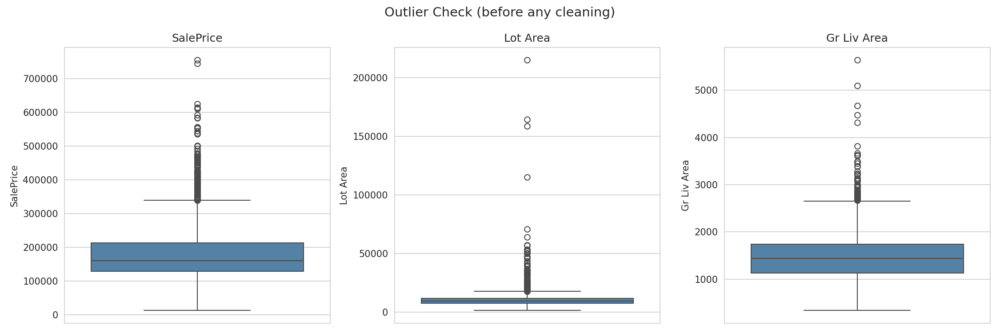

### 6.2 Missing Value Treatment
Missing values were **not** handled with a single blanket rule. Each column was treated according to *why* the value is missing:
- Columns where a missing value genuinely means "feature absent" (e.g. no basement → 0 sqft) were filled with 0.
- Continuous skewed numeric columns (`Lot Frontage`, `Mas Vnr Area`) were imputed with the median.
- `Garage Yr Blt` was only imputed for houses that actually have a garage — houses without a garage keep it as missing, tracked separately via a `Has_Garage` flag.
- Categorical columns where missing means "feature doesn't exist" were filled with an explicit `"NA"` category, not silently dropped or guessed.

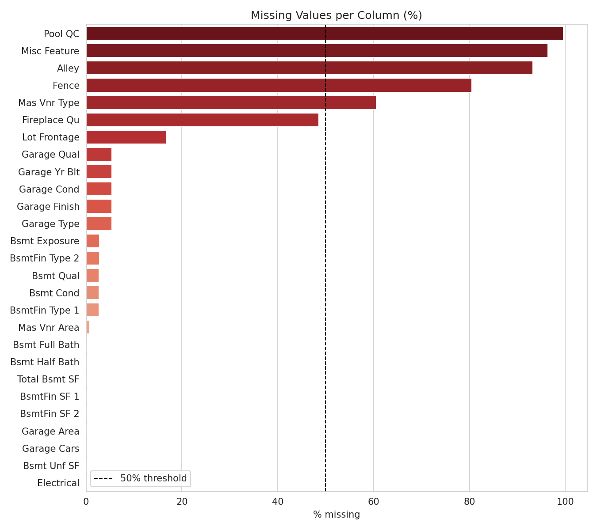

### 6.3 Feature Engineering
Columns with extremely high missing rates (`Pool QC`, `Misc Feature`, `Alley`, `Fence` — all above 60% missing) were converted into simple binary presence flags (`Has_Pool QC`, etc.) rather than imputed, since attempting to guess a quality rating for a feature that 95%+ of houses don't even have would introduce fabricated information.

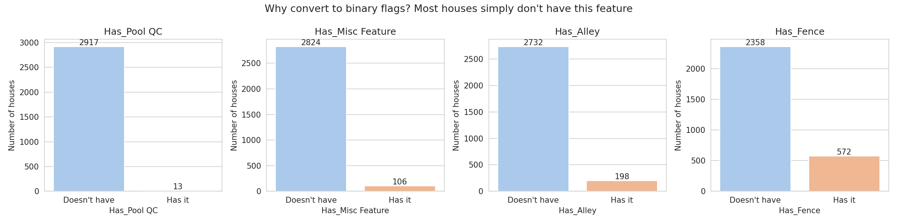

### 6.4 Low-Variance Feature Review
A custom function automatically flags columns that are dominated by a single value (>80% of rows) **and** show no meaningful relationship with `SalePrice` (either weak numeric correlation, or a small price gap between the dominant category and the rest). Engineered `Has_*` flags are explicitly protected from this filter, since their rarity is itself meaningful.

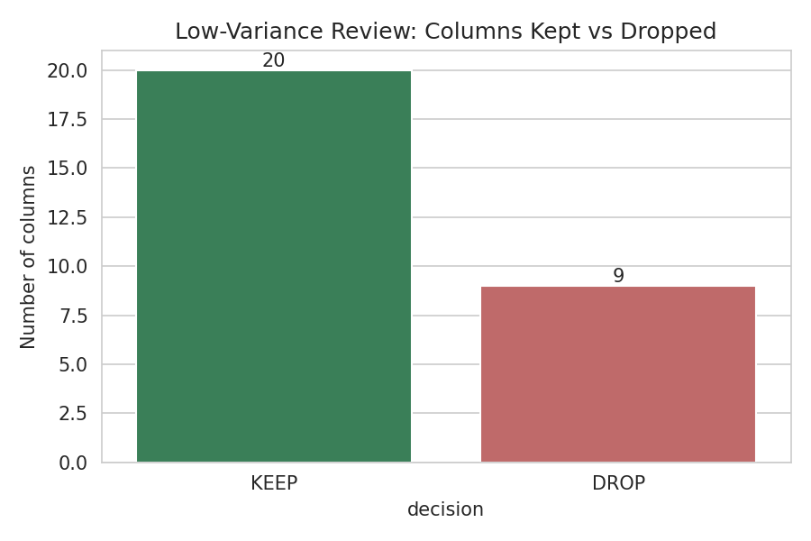

### 6.5 Redundancy Removal
Pairs of numeric features with |correlation| > 0.8 (e.g. `Garage Cars` vs `Garage Area`) were identified, and for each pair the feature more weakly correlated with `SalePrice` was dropped to reduce multicollinearity.

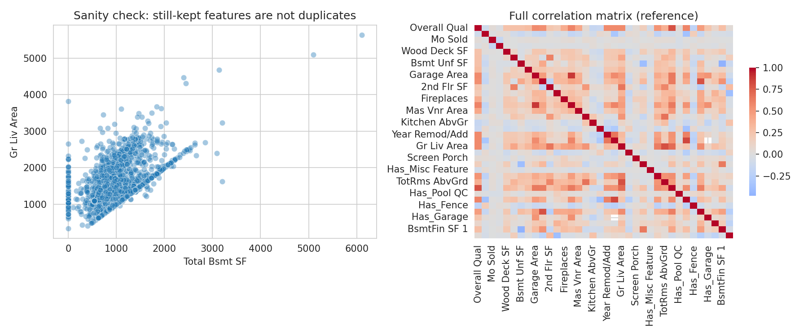

### 6.6 Identifier Removal
`Order` and `PID` were dropped — they carry zero predictive signal and have no place in an analysis-ready dataset.

### 6.7 Encoding
- **Ordinal columns** (quality scales like `Kitchen Qual`: Po < Fa < TA < Gd < Ex, and domain-specific scales like `BsmtFin Type`, `Garage Finish`, `Functional`) were mapped to ordered integers, preserving their inherent ranking.
- **Binary columns** (`Street`, `Central Air`) were mapped directly to 0/1.
- **Nominal columns** (`Neighborhood`, `Exterior 1st`, `Sale Type`, etc. — no inherent order) were One-Hot Encoded with `drop_first=True` to avoid the dummy-variable trap.

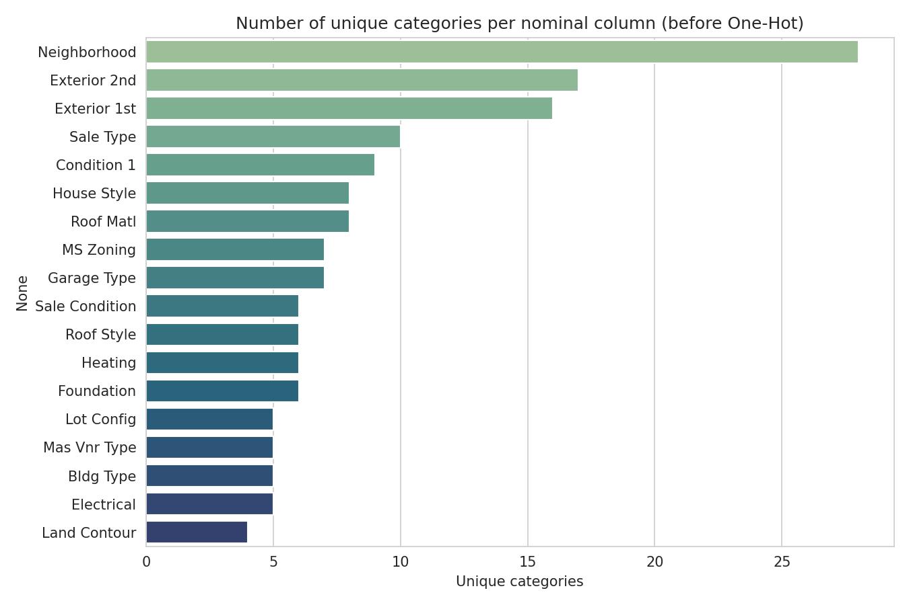

### 6.8 Normalization — Robust Scaling

**Chosen method: Robust Scaling** (`(X - median) / IQR`), instead of Min-Max or Z-score.

Both `SalePrice` and `Lot Area` contain real, legitimate outliers (several houses with values multiple times larger than the 75th percentile). A dedicated stability test was run: a single synthetic extreme outlier was injected, and the scaled value of a *typical* house was measured before/after under each method. Robust Scaling's representation of typical houses barely moved (shift ≈ 0.0006), while Min-Max and Z-Score shifted by 50–90x more — proving Robust Scaling's parameters (median, IQR) are far less sensitive to extreme values.

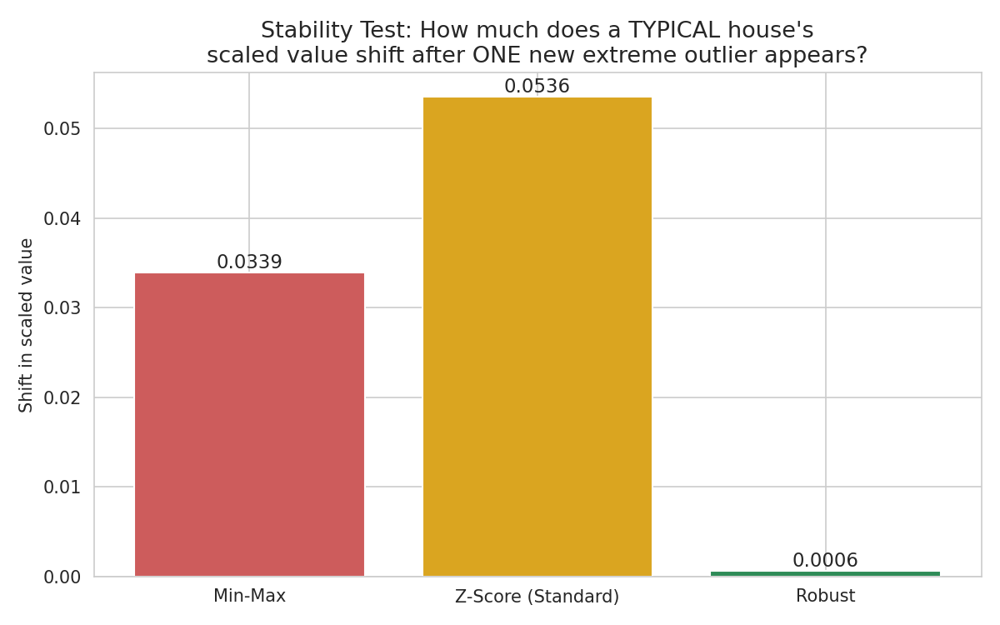

### 6.9 Outlier Handling Decision
Outliers were **deliberately not removed**. They represent real, legitimate high-end properties (not data-entry errors), and removing them would discard information about the luxury market segment. Robust Scaling was chosen specifically to reduce their statistical influence without losing them.

### 6.10 Visualization
Each chart answers a specific business question (not generated for decoration):

| Chart | Question Answered |
|---|---|
| 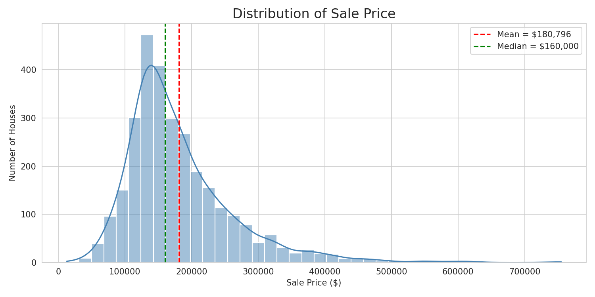 | Is `SalePrice` normally distributed? → It is right-skewed; mean > median. |
| 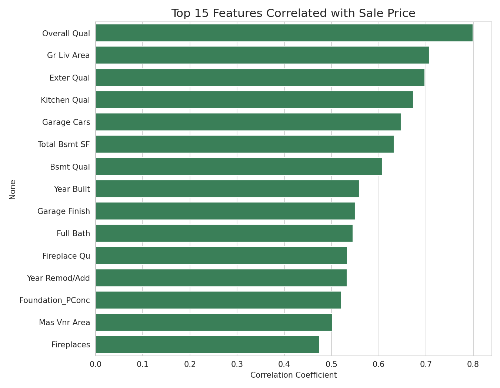 | Which features matter most? → `Overall Qual`, `Gr Liv Area`, `Exter Qual`, `Kitchen Qual`, `Garage Cars`. |
| 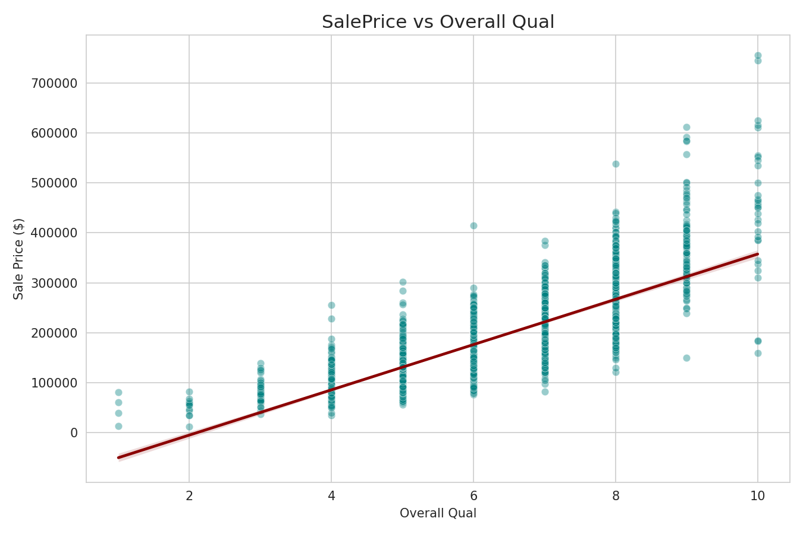 | How does the top feature relate to price? → Strong, roughly linear. |
| 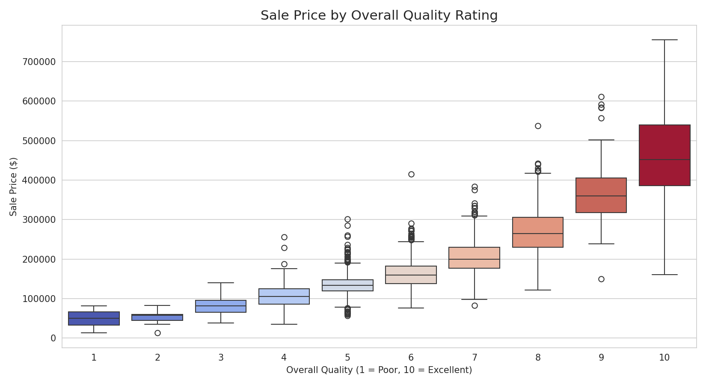 | Does quality rating translate to real price premium? → Yes, a clear monotonic step-up. |
| 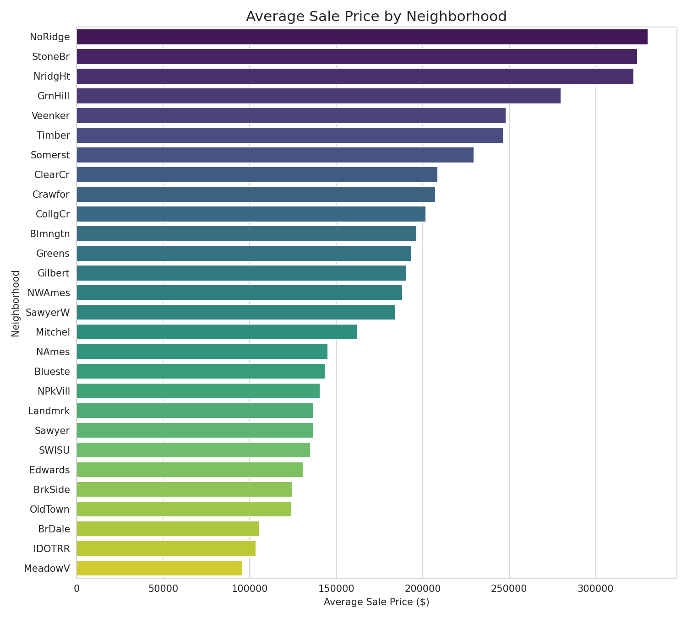 | Which neighborhoods are most/least expensive? → `NoRidge` highest, `MeadowV` lowest — over 3x gap. |
| 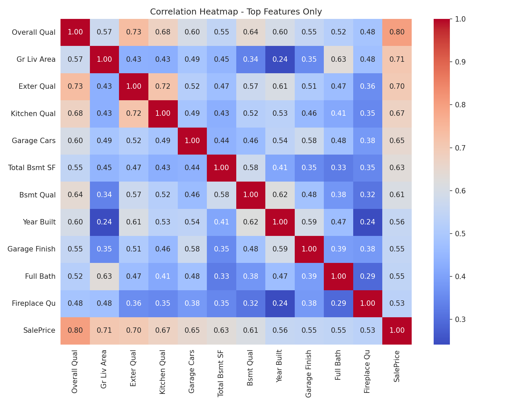 | How do the top features relate to each other? → Readable heatmap limited to the top 11 features only. |

---

## 7. Key Findings

- `SalePrice` is **right-skewed** — mean ($180,796) > median ($160,000).
- Top price drivers: **Overall Qual (0.80)**, Gr Liv Area (0.71), Exter Qual (0.70), Kitchen Qual (0.67), Garage Cars (0.65).
- Overall Quality shows a strong, consistent, monotonic relationship with price.
- Highest-priced neighborhoods: **NoRidge, StoneBr, NridgHt** (~$320K–330K average).
- Lowest-priced neighborhoods: **BrDale, IDOTRR, MeadowV** (~$95K–106K average).

## 8. Business Recommendations

- **Renovation ROI:** Quality-focused renovations (kitchen, exterior finish) are likely to yield a stronger price lift than size-only additions, given how strongly quality ratings correlate with price.
- **Investment targeting:** NoRidge, StoneBr and NridgHt offer the best resale positioning for premium listings.
- **Value opportunities:** BrDale and IDOTRR may be worth investigating for undervalued-entry investment opportunities.
- **Next step:** Given the skew in `SalePrice`, a log-transform of the target should be tested before any regression modeling, to stabilize variance.

---

## 9. Repository Structure

```
├── Ames_Housing_Analysis.ipynb   # Full, reproducible analysis notebook (code only)
├── README.md                     # This file (English)
├── README.ar.md                  # Arabic version
└── figures/                      # All exported charts (PNG)
```

## 10. How to Run

1. Download the dataset from [Kaggle](https://www.kaggle.com/datasets/shashanknecrothapa/ames-housing-dataset) as `AmesHousing.csv` and place it in the same folder as the notebook.
2. Install dependencies: `pandas`, `numpy`, `matplotlib`, `seaborn`, `scikit-learn`.
3. Run `Ames_Housing_Analysis.ipynb` top to bottom.

---

## 11. Possible Next Steps

- Log-transform `SalePrice` to correct skew before modeling.
- Train a baseline regression model (e.g. Linear Regression, Random Forest) on `ames_clean_encoded_scaled.csv` to predict `SalePrice`.
- Evaluate feature importance from a trained model and compare against the correlation-based ranking in this project.
